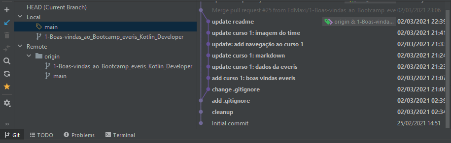

# Digital Innovation One - _Like a Pro_

Este repositório é uma ferramenta poderosa para desenvolver a capacidade dos alunos em organizar os seus estudos,
os códigos fontes, a documentação e tudo que é útil para um programador profissional ser produtivo.

<!-- 

-->

## Índice

---

- [Objetivo](#objetivo)
- [DIO e Github](#dio-e-github)
- [Como usar este template](#como-usar-este-template)
- [Clonando o repositório e trabalhando na sua IDE](#clonando-o-repositório-e-trabalhando-na-sua-ide)
- [Conclusão](#conclusão)

### Objetivo

---

Concluir os Cursos e Bootcamps colocando em prática o uso do Github `like a pro`

### DIO e Github

---

Aqui estão as definições dos recursos de cada plataforma e como eles se relacionam.

| DIO | <-> | Github |
| :---: | :---: | :---:|
| Bootcamp | <-> | Milestones |
| Cursos | <-> | Issues |
| Aulas | <-> | Branchs
| Nível | <-> | Labels

- Cada `Bootcamp` é um `Milestone`
- Cada `Curso` é um `Issue`
- Cada `Aula` é um `Branch`
- Cada `Nível` é um `Label`

---

### Como usar este template

1. Faça um _Fork_ deste repositório, configure-o com as opções abaixo:
    * Em **Settings > Options**, marque estas opções:
        - `Features`
            - [x] Issues
        - `Merge Button`
            - [x] Allow auto-merge
            - [x] Automatically delete head branches
    * Em **Issues > Milestones**, crie um milestone com o prefixo `Bootcamp - ` e o nome do Bootcamp
      e o prazo de finalização.
      Ex:
      >Bootcamp - everis Kotlin Developer
    * Em **Issues > Labels**, apague todas e crie estas 3:  
      `básico` `intermediário` `avançado`

1. Para cada curso, crie um `issue` e relacione `label` e `milestone`

### Clonando o repositório e trabalhando na sua IDE

---

1. Clone este repo:
   `git clone https://github.com/<USERNAME>/dio-template.git`

1. Para cada aula, crie um `branch` com o nome da aula e faça seus `commits` e `pushs`
1. Após concluir um curso, faça um `pull request (PR)` e relacione com o `issue` do curso

### Conclusão

---
O status do seu bootcamp (milestone) será atualizado a cada vez que você concluir um curso.
E sua missão é completar todos os cursos para completar os seus estudos.

- Seu `PR` será fechado automaticamente (merge automático)
- Seu `branch` será integrado ao `main` e então excluído
- Seu `issue` é fechado por conta da conclusão do `PR` linkado à ele
- Seu `milestone` é atualizado com o status desse `issue` concluído

> `Dica` Documente sua evolução, preencha o README de cada aula com o que fez mais sentido pra você

