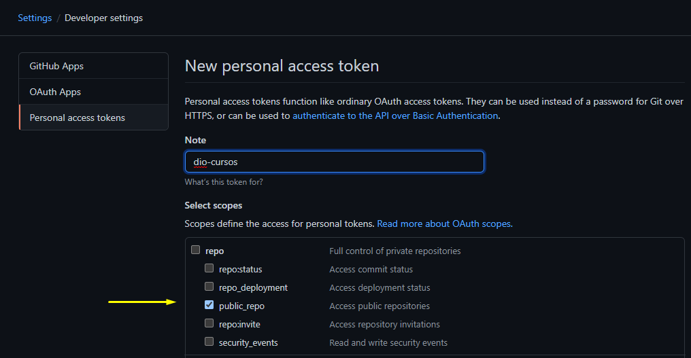
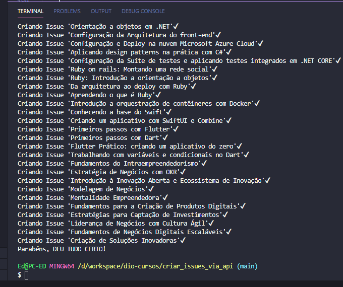

# Criando issues via API 

Para facilitar a criação massiva dos cursos da DIO neste repositório, temos um comando especial que vai poupar o seu tempo!
Através do comando abaixo, criaremos todos os `Issues` automaticamente no repositório, inclusive com `Labels` e `Milestones`.

Atualmente a DIO possui 83 Cursos disponíveis e 19 Formações.
Criar toda a estrutura no repositório dá um bom trabalho, e por isso este script vai te ajudar demais!

## Vamos lá!

1. [Crie um Personal Token do Github](https://github.com/settings/tokens/new) com a permissão `public_repo`

   
1. Crie um arquivo `.env` com seu token no formato `TOKEN=SEUTOKENAQUI`
1. Agora execute os comandos abaixo no seu terminal:
    ```bash
    cd criar_issues_via_api
    npm install
    npm run deploy
    ```
Feito, agora tá tudo pronto pra usar!

