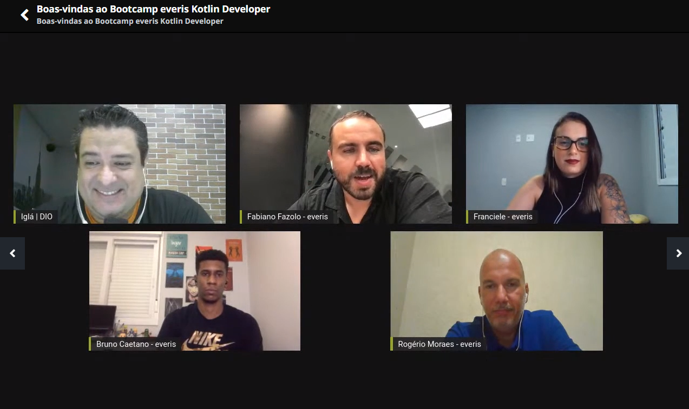

# Boas-vindas ao Bootcamp everis Kotlin Developer

A Everis é uma das maiores empresas de TI do mundo.

### Aqui vão alguns dados da empresa

- Presente em 18 países
- Mais de 24.500 profissionais
- Volume financeiro de 1.43 bilhões de euro no último ano fiscal
- 20 anos de evolução nas Americas

### No Brasil
- Gerente de people: `Renata Transmonte`
- Diretor de Digital Banking: `Fabiano Fazolo`
- Mais de 3.300 funcionários

